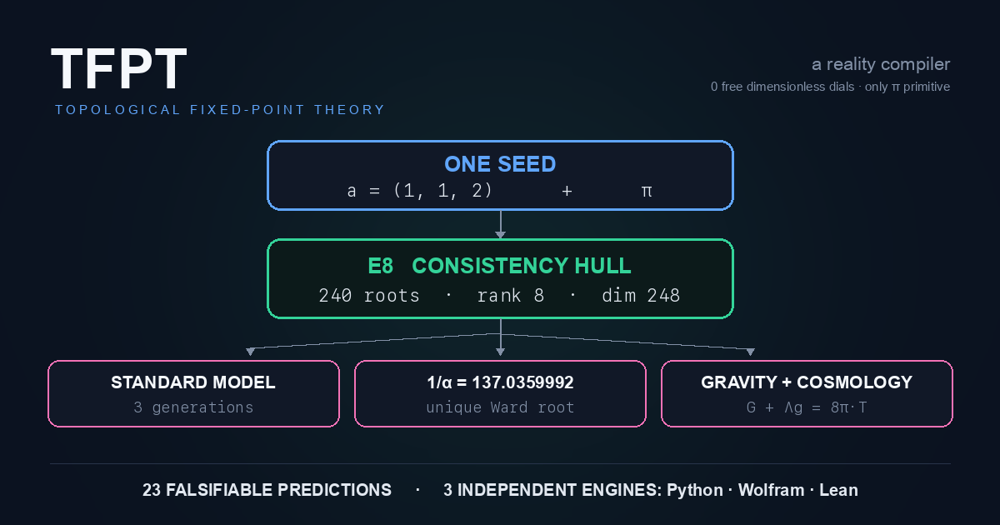
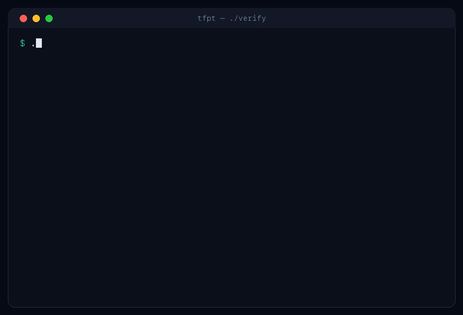

<div align="center">

# TFPT

### Can the structure of fundamental physics be compiled from one discrete seed and π?

<a href="assets/readme/00_hero.png"></a>

**TFPT is a falsifiable, machine-checked framework that reconstructs major dimensionless structures
of particle physics, gravity and cosmology from `a = (1, 1, 2)` and `π`** — a *candidate*
parameter-free compiler for the dimensionless skeleton of fundamental physics.

<p>
  <a href="https://github.com/sthamann/tfpt/actions/workflows/verify.yml"></a>
  <a href="https://github.com/sthamann/tfpt/actions/workflows/audit.yml"></a>
  <a href="https://github.com/sthamann/tfpt/actions/workflows/lean.yml"></a>
  <br>
  
  
  
  <a href="https://doi.org/10.5281/zenodo.20846087"></a>
  <a href="https://www.fixpoint-theory.com"></a>
</p>

**[▶︎ Understand it in 5 minutes](https://www.fixpoint-theory.com/#intro-video)** ·
**[⚡ Run the verifier](#run-the-verifier)** ·
**[📄 Read the theory](docs/THEORY.md)**

</div>

This repository contains the complete theory, **23 frozen predictions**, three independent
verification engines (Python + Wolfram + Lean), and a versioned status ledger that types every
claim — including its **explicit open problems and falsification criteria**.

---

## Start here

Different readers want different proof. Pick your route:

| I am… | Start with |
|---|---|
| a **physicist** | [`docs/FOR_PHYSICISTS.md`](docs/FOR_PHYSICISTS.md) — the assumptions, the derivation, the open interfaces |
| a **mathematician** | [`docs/FOR_MATHEMATICIANS.md`](docs/FOR_MATHEMATICIANS.md) — the `E8` closure and the formal certificates |
| here to **verify the claims** | [Run the 30-second verifier](#run-the-verifier), then [`docs/VERIFICATION.md`](docs/VERIFICATION.md) |
| here for the **intuition** | [the 5-minute film](https://www.fixpoint-theory.com/#intro-video) |
| here to **falsify it** | [`docs/FALSIFICATION.md`](docs/FALSIFICATION.md) — the kill tests |

---

## Run the verifier

Re-derive TFPT's headline claims from the two axioms, in about a second:

<p align="center"></p>

```bash
git clone https://github.com/sthamann/tfpt && cd tfpt
pip install -r requirements.txt

./verify            # ~1s    : the core claim, re-derived from the axioms
./verify --full     # ~4min  : the entire Python suite (ALL CHECKS PASSED)
./verify --release  #         : documents + suite + website + sync audit
```

No local toolchain? `docker run --rm ghcr.io/sthamann/tfpt:latest`. The three independent engines
are one flag away: `./verify --wolfram`, `./verify --lean`, `./verify --audit`. Full detail in
[`docs/VERIFICATION.md`](docs/VERIFICATION.md).

---

## The five results — and their honest status

Not everything below has the same epistemic status, and saying so is the point:

| Claim | Result | Status |
|---|---|---|
| `E8` closure | `(D5 ⊕ A3) + μ4 ≅ E8`, 240 roots, glue index 4 | **Exact** — machine-proven lattice identity `[E]` |
| Number of generations | `N_fam = 3` | **Exact within the compiler** `[E]` |
| Fine-structure constant | `α⁻¹ = 137.0359992` | **Exact numerical identity** — unique Ward root, interval-verified `[E]` (1.9σ from CODATA-2022) |
| Physical origin of the seam | `SEAM.EQUIV.01` | **Open** — closed *modulo a cited theorem*, not proven end-to-end `[O]` |
| Cosmic birefringence | `β = φ₀/(4π) ≈ 0.2424°` | **Falsifiable prediction** — decided by CMB polarimetry `[X]` |

Markers: `[E]` exact/machine-proven · `[C]` conditional · `[O]` open/axiom · `[X]` kill test. The
authoritative per-claim status is [`verification/status_ledger.csv`](verification/status_ledger.csv)
— **the ledger wins**. Full matrix and marker system in [`docs/CLAIMS.md`](docs/CLAIMS.md).

---

## What is genuinely open

The discrete/algebraic compiler is closed (`[E]`). The honest residual is **three named interface
problems**, not a diffuse list:

| Interface | Question | Status |
|---|---|---|
| `v_geo` | the one metrology unit (`= 1/√G`); No-Unit Thm: a scale-invariant seam has no compiler scale | primitive `[O]` |
| `SEAM.EQUIV.01` | the raw seam *is* the holomorphic `(E8)₁` net | `[C]` — closed modulo a cited theorem |
| `F_transfer` | one functor, four typed interfaces (Koide, `η_B`, axion, `m_p/m_e`) | `[C]` |

TFPT does **not** claim a certified Theory of Everything — the full treatment (parameter-free
gravity, the all-orders perturbative leg, the `SEAM.EQUIV.01` status) is in
[`docs/OPEN_PROBLEMS.md`](docs/OPEN_PROBLEMS.md).

---

## How to falsify TFPT

The predictions are frozen **before** the data ([`predictions_frozen.json`](verification/predictions_frozen.json),
2026-06-09) and locked to their formulas on every run. A confirmed measurement outside a window
kills the claim:

| Observable | TFPT frozen value | Decided by |
|---|---|---|
| Leptonic CP phase | `δ_PMNS = 240°` (Galois-locked) | DUNE, Hyper-K |
| Cosmic birefringence | `β ≈ 0.2424°` | CMB polarimetry |
| Reactor angle | `sin²θ₁₃ = 0.02311` *(now ~2.0σ tension)* | JUNO |

All kill tests, the null model (200,000 look-alikes score ≤ 5/13; TFPT 13/13), and the live
scorecard: [`docs/FALSIFICATION.md`](docs/FALSIFICATION.md) ·
[fixpoint-theory.com/falsification](https://www.fixpoint-theory.com/falsification).

---

## Try to break TFPT

For a fundamental-physics theory, **openly invited criticism is a trust signal**. The most valuable
contributions, in order of impact:

1. **Reproduce or falsify a frozen prediction.**
2. **Find a circular dependency** — a "derived" quantity that used its own target.
3. **Identify an unstated physical assumption** doing load-bearing work.
4. **Challenge a claimed uniqueness result** (the `E8` glue, the `α⁻¹` root).
5. **Close or kill one of the three open interfaces.**

Ready-made [issue templates](.github/ISSUE_TEMPLATE) exist for exactly these: *claim challenge*,
*reproduction failure*, *mathematical counterexample*, *physical interpretation*, *prediction
update*, and *documentation*. This repository is meant to be a scientific discussion space, not
just an archive.

---

## Repository structure

```
├── verify                 # the one-command verifier (quick / --full / --release)
├── README.md              # you are here
├── docs/                  # THEORY · CLAIMS · OPEN_PROBLEMS · FALSIFICATION
│                          # VERIFICATION · FOR_PHYSICISTS · FOR_MATHEMATICIANS
├── verification/          # 487 machine checks, run_all.py, the status ledger,
│                          # the Wolfram second path, the red-team layer
├── experiments/           # research explorations + the Lean 4 proofs (not claims until promoted)
├── website/               # the public mirror (fixpoint-theory.com), kept byte-identical by the audit
├── *.tex                  # the 9 active theory documents (see docs/THEORY.md)
└── build.sh               # the build + sync pipeline (notes · gen · website · audit · release)
```

> _Disambiguation:_ this is the **physics** theory TFPT (a compiler closure for the Standard Model).
> It is not the unrelated Brouwer–Lefschetz "topological fixed point theory" of mathematics.

---

## Citation & license

```bibtex
@misc{hamann2026tfpt,
  title  = {Topological Fixed-Point Theory (TFPT): Two Axioms, One Compiler,
            the Standard-Model Skeleton Derived},
  author = {Hamann, Stefan and Rizzo, Alessandro},
  year   = {2026},
  note   = {Version 5.4},
  doi    = {10.5281/zenodo.20846087},
  url    = {https://doi.org/10.5281/zenodo.20846087}
}
```

- **Website (interactive):** <https://www.fixpoint-theory.com> — reading guide, compiler walkthrough,
  in-browser reproducer for every script.
- **Archived deposit (DOI):** <https://doi.org/10.5281/zenodo.20846087> (Zenodo, v5.4).
- **AI/agent context:** <https://www.fixpoint-theory.com/llms.txt>

*Claim discipline: nothing in this repository is marked closed that is not machine-verified, and no
dimensionful quantity is claimed as a derivation from pure numbers.*
