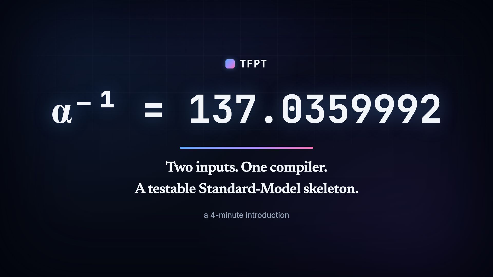
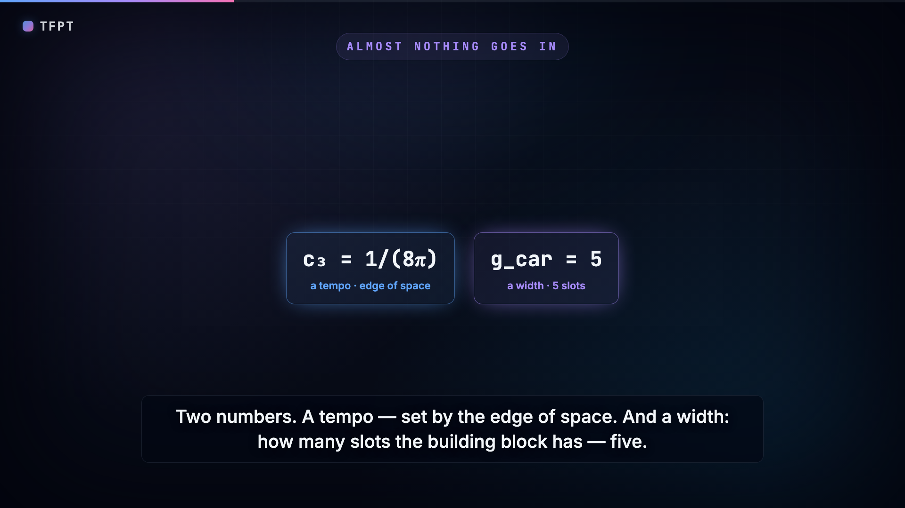
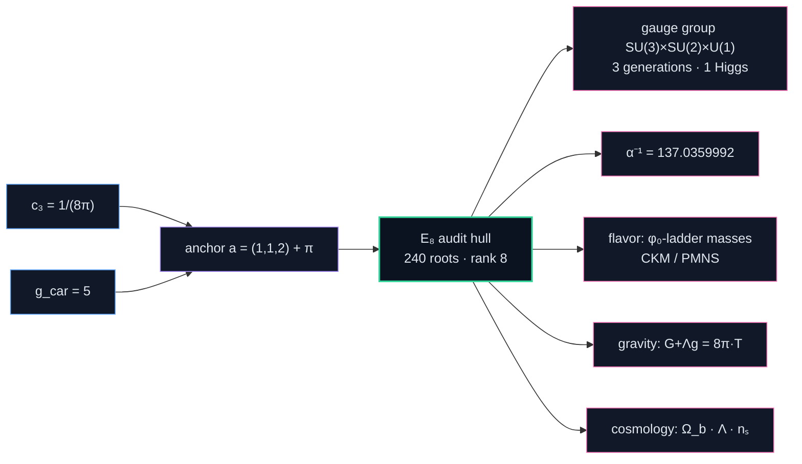
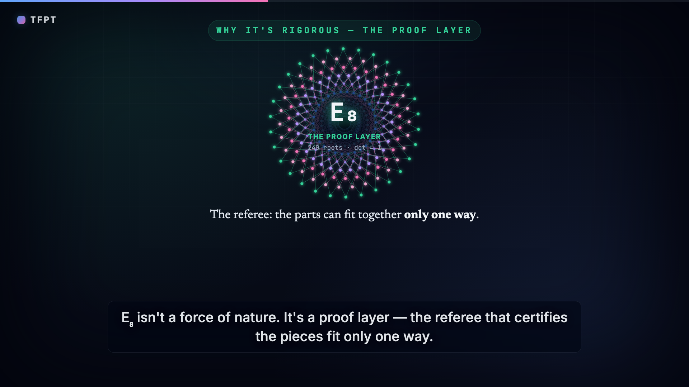
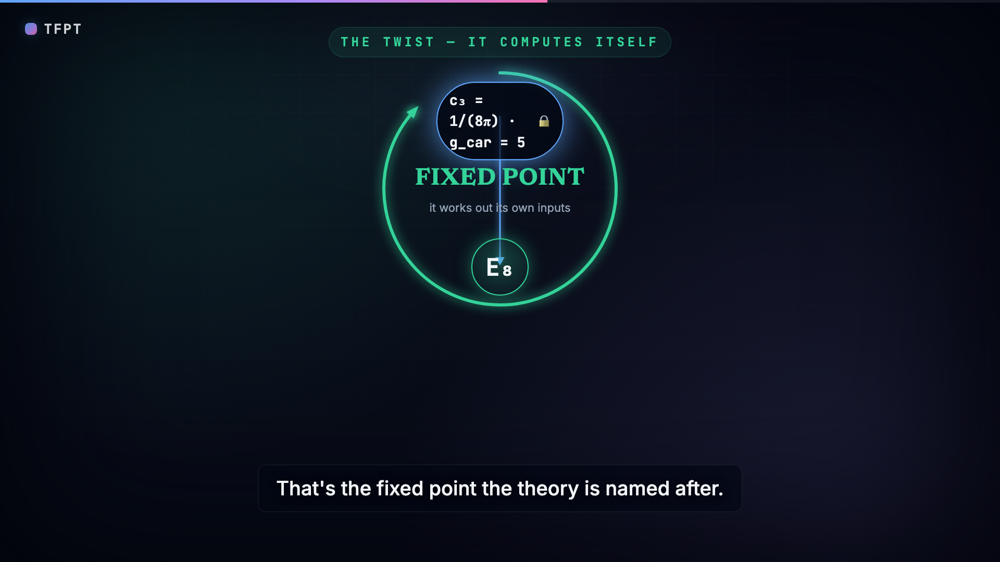
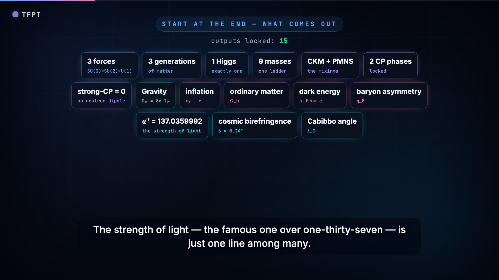
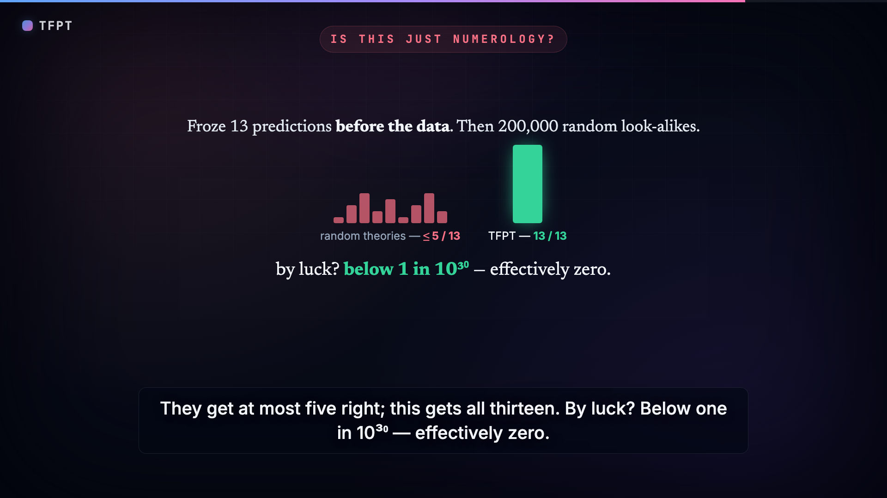

<div align="center">

# TFPT — Topological Fixed-Point Theory

<strong>A closed discrete compiler for the dimensionless skeleton of the Standard Model and cosmology —<br/>built from two numbers and π, with every load-bearing claim machine-checked.</strong>

<p>
  
  <a href="https://www.fixpoint-theory.com"></a>
  <a href="https://doi.org/10.5281/zenodo.20846087"></a>
  
  
</p>

<p>
  <a href="https://www.fixpoint-theory.com/orientation"><b>Reading guide</b></a> ·
  <a href="https://www.fixpoint-theory.com/compiler">How the compiler works</a> ·
  <a href="https://www.fixpoint-theory.com/verification">Reproduce in-browser</a> ·
  <a href="https://www.fixpoint-theory.com/falsification">How to falsify</a> ·
  <a href="https://www.fixpoint-theory.com/faq">FAQ</a>
</p>

<h3>▶︎ Watch the film — <em>Is reality compiled?</em> (5 min)</h3>

<a href="https://www.fixpoint-theory.com/#intro-video">
  
</a>

<p><sub>▶︎ Click to play on the website — with chapter markers and the full transcript &nbsp;·&nbsp; <a href="https://www.fixpoint-theory.com/intro/tfpt-intro.mp4">direct MP4</a></sub></p>

</div>

> _Disambiguation:_ this is the **physics** theory TFPT (a compiler closure for the Standard Model). It is
> not the unrelated Brouwer–Lefschetz "topological fixed point theory" of mathematics (Nielsen/Lefschetz numbers).

TFPT models physics as a small deterministic *compiler*: two boundary inputs are fed in, an
`E8` "audit hull" is built as an intermediate object, and the Standard-Model + cosmology
read-outs fall out as **projections** — through a chain of exact identities and lattice/Lie
theorems, not fits. This repository contains the theory documents, a full Python + Wolfram +
Lean verification stack, and a versioned status ledger that types every claim.

**Contents** &nbsp;·&nbsp; [1 · The theory in one page](#1-the-theory-in-one-page) &nbsp;·&nbsp; [2 · Repository structure](#2-repository-structure) &nbsp;·&nbsp; [3 · Reproduce / verify](#3-reproduce--verify) &nbsp;·&nbsp; [4 · Status markers](#4-status-markers) &nbsp;·&nbsp; [5 · What is genuinely open](#5-what-is-genuinely-open) &nbsp;·&nbsp; [Links & citation](#links--citation)

---

## 1. The theory in one page

### The two inputs

| Input | Symbol | Value | Role |
|---|---|---|---|
| Seam normalisation (P1) | `c₃` | `1/(8π)` | boundary/horizon constant |
| Carrier rank (P2) | `g_car` | `5` | the `3+2` carrier interface |

<p align="center">
  <br>
  <sub><em>The entire dimensionless input layer: a tempo <code>c₃ = 1/(8π)</code> and a width <code>g_car = 5</code>.</em></sub>
</p>

These two collapse further: both are the elementary-symmetric data of the **parabolic anchor**
`a = (1,1,2)`, so the genuine input layer is `a` plus the single transcendental `π`
(`c₃ = 1/(2·e₁(a)·π) = 1/(8π)`). The carrier choice `g_car = 5` is itself an *over-determined
bootstrap fixed point* (forced three independent ways via the `E8` closure), so the theory has
**no free load-bearing number** on the dimensionless axis — only `π` is primitive.

### The compiler pipeline



<details>
<summary>Show the exact text pipeline (with every intermediate identity)</summary>

```
  c₃ = 1/(8π)  ┐
               ├─►  anchor a=(1,1,2)  ──►  powers pₙ=2+2ⁿ ─► |R(E8)|=240, dim E8=248, rank 8
  g_car = 5    ┘                                            (E8 = audit/compiler hull, NOT a gauge group)
        │
        ├─►  carrier D5 ⊕ A3 + μ4  ──►  gauge group, hypercharge, N_fam = 3
        │
        ├─►  φ₀ = 1/(6π) + 48·c₃⁴  ──►  α⁻¹ = 137.0359992  (unique root of the boundary Ward identity)
        │
        ├─►  lattice operators (Q,K,R,L) on H₁(P¹∖μ4)=ℤ³,  det = (3,4,8,20),  ∏ = 1920 = |W(D5)|
        │         └─►  masses (φ₀-ladder), lepton c = (16/7, 4/3, 7/6), quark ratios (integer Plücker)
        │
        └─►  c₃ = Einstein/Jacobson 8π coefficient ─► full covariant G_ab+Λg_ab = c₃⁻¹T_ab (both coeffs fixed,
                                                       v359); R+R² scalaron M ≈ 3.06×10¹³ GeV; Λ ~ e^(−2α⁻¹);
                                                       Ω_b = (1−1/4π)φ₀ ≈ 0.04894
```

</details>

<table>
<tr>
<td width="50%" align="center">
  <br>
  <sub><em><b>E₈ is the referee, not a force.</b> The parts can lock into its 240-root pattern only one way — so most possible universes simply don't compile.</em></sub>
</td>
<td width="50%" align="center">
  <br>
  <sub><em><b>The loop closes on itself.</b> The proof shuts only for one tempo and one width, so the structure forces its own inputs — the fixed point the theory is named after.</em></sub>
</td>
</tr>
</table>

<p align="center">
  <br>
  <sub><em>What comes out of those two numbers — the whole Standard-Model skeleton, gravity, pieces of cosmology, and <code>α⁻¹</code> as just one line among many.</em></sub>
</p>

### What it produces (selected, all machine-checked)

- **`α⁻¹ = 137.0359992`** as the *unique* root of a boundary `U(1)` Ward identity (existence +
  uniqueness, interval-arithmetic verified).
- **Three fermion generations** `N_fam = 3 = rank A3 = dim H₁(P¹∖μ4)`.
- **Flavor**: an integer operator ladder with `det(Q,K,R,L) = (3,4,8,20)`, product
  `1920 = |W(D5)|`; charged-lepton coefficients `(16/7, 4/3, 7/6)` exactly; quark mass *ratios*
  as integer Plücker readouts (`c_u/c_d = 55/117`, …).
- **Solar angle** `sin²θ₁₂ = 1/3 − φ₀/2 = 0.306747` (frozen prediction of record, machine-enforced
  via `predictions_frozen.json`/`v84`; conditional on the seam-misalignment lemma).
- **Cosmology**: `Ω_b`, the Starobinsky scalaron mass, `Λ ~ e^(−2α⁻¹)`, cosmic birefringence
  `β = φ₀/(4π) ≈ 0.2424°`; the former external band `N_star ∈ [50,60]` is sharpened to a
  *conditional* point `N_star(k=0.05/Mpc) = 51.4` `[P]` via the scalaron-reheating chain (`v86`;
  `n_s = 0.9611`, `r = 0.0045`) — honestly recorded: the slow Higgs-channel point is
  `A_s`-disfavoured (−11.4σ; the measured `A_s` requires near-instantaneous reheating), so the
  frozen band stays the surface of record.
- **Self-consistency**: under the named gapped-transport hypotheses, "parameter-free" is a
  *theorem* — the gapped boundary transport (`Δ = 6·log(3/2) > 0`) has, by Perron–Frobenius, a
  **unique attractor** at rate `(2/3)⁶` (the physical identification of the transport operator
  stays `[P]`); the hull carries a literal order-`30 = 2·3·5` Coxeter cycle.

<details>
<summary><b>More machine-checked structural results</b> — icosahedral bedrock, master cover, spine tetrahedron, flavor diamond, the boundary QFT as one object</summary>

- **Icosahedral bedrock** (`v219`): *why* the atoms are `{2,3,5}` — `E₈` is the exceptional top of
  the McKay tower of finite `SU(2)` subgroups (`2I`, order `120 = |R⁺(E₈)|`, has irrep degrees equal
  to the affine-`E₈` Kac marks, `Σ = 30 = h(E₈)`), so choosing `E₈` is choosing the icosahedron. A
  backward certificate, not a P2 proof; the same geometry reads `41` (EM index) as a Gaussian norm and
  `7` (scalaron) as an Eisenstein norm of the one carrier split (`v222`).
- **Master cover** (`v85`): all anchor-block pencil covers are *one* double cover up to GL(2)
  Möbius reparametrisation (`disc = N_fam⁴·det(G)²`); Koide and the carrier are its two branch
  points, the scalaron exponent its trace; `μ₄` is *not* a 4:1 cover of the line (honest negative).
- **Spine tetrahedron** (`v91`): the spine `{2,3,4,5} = {e₃(a), p₀(a), e₁(a), e₂(a)}` is *one*
  finite object — edges `{6,8,10,12,15,20}`, faces `{24,30,40,60}`, volume `120 = |R⁺(E8)|`;
  `240 = |μ₄|·|E(K₄)|·|E(K₅)|` (breaks at `K₆` — specific, not generic). Dual cuts are typed as
  tautological presentation; `7, 16, 41, 48, 240, 248` lie *outside* the sub-grammar (honest).
  The tetrahedron is the *presentation raster of the anchor microcode* — the engine stays
  `a = (1,1,2)` (plus `p₀(a) = 3`).
- **Centered flavor diamond** (`v95`): the four flavor operators are *one* center plus *two*
  axes — `Q = U+V`, `R/L = C∓U` (winding), `K/F = C∓V` (sheet, `Spec V = {0,1,2}` = the cusp
  class); the center has `det C = 14`, `ΣC = 31 = 2^g−1` (the IR gap-bound numerator),
  `Pl_R(C) = 7·(2,3,1)` — the `G₂` reading stays audit-typed.
- **The boundary QFT as one relative object** (`v238`–`v261`, *Modular Spectral Closure*): the
  emergent-QFT round assembles the seam into `TFPT_QFT = (A_Σ, ω_Σ, Δ_Σ, ρ, A_F, H_F, D_F, J, γ, S_rel)`
  and collapses it to a single object. The 96-dim finite spectral triple (`A_F = ℍ_L⊕ℍ_R⊕M₄(ℂ)`, KO-6,
  order-zero, the first-order condition violated *exactly* by the Majorana = the CCvS σ mechanism, `v252`)
  is closed by three moves: the finite Dirac is the **modular/covariance induction** of the seam KMS state
  (`[D_F] = [D_Σ]⊗[K_car]`, the Yukawas a readout of `C_Σ`, `v258`); the spectral-action **cutoff is that
  KMS weight** so `f₂/f₀ = 1` exactly and `κ` becomes a finite-triple trace ratio (`v259`); and the seam
  (pillowcase), the carrier-16 (Kummer nodes) and `E₈` (`H²(K3) = U³⊕E₈(−1)²`) are facets of **one
  Kummer/K3 surface** (`v260`). The assembly certificate (`v261`) pins the cross-consistency — one number
  `4 = [B:A] = |μ₄| = 2χ = |(ℤ/2)²|`, one carrier-16, one gap `6log(3/2)` — so the layer is *QFT-complete
  modulo a single named theorem*, the **Seam Equivalence Theorem** `SEAM.EQUIV.01` (*the raw RP seam IS the
  holomorphic `(E8)₁` net at `τ=i`*; `v286`–`v288`). After the closing arc (`v300`–`v302`) that theorem's
  residual carries **no undischarged TFPT-internal assumption** — it is a composition of standard cited theorems
  (Steklov rigidity, the free-fermion classification, the AQFT stack) over established facts (the carrier-16, the
  derived gap `6log(3/2)>0`) — though it stays `[O]` (not machine-proved end-to-end). Ambient QG kept separate.

</details>

### Honest scope — the four layers

TFPT does **not** claim a certified strict Theory of Everything. It is honestly typed in four
layers (this separation is the discipline of the whole package):

| Layer | Content | Status |
|---|---|---|
| **1. Closed compiler** | `E8` glue, carrier, `α⁻¹`, `(R,K,Q,L)`, lepton/quark *ratios* | `[I]/[L]/[N]` |
| **2. Protected IR physics** | `R+R²`, admissible gapped transfer sector (OS-reconstructed *under RP/gap hypotheses*); the boundary QFT as one relative object (Modular Spectral Closure: Dirac = covariance induction, cutoff = KMS weight, seam/carrier/E₈ on one K3) | `[I]/[P]` |
| **3. Anchors** | `π`, one dimensionful induced-gravity scale, `U_point` absolute amplitude norm | `[A]` (declared, not "missing") |
| **4. Interfaces** | `m_p/m_e`, `η_B` (leptogenesis), Koide, axion relic, full ambient QG measure | `[P]/[A]` |

The single remaining **central theorem target** is to derive the
`1/(8π)` area-law coefficient from the replica variation of the seam determinant. Its *structure*
is closed (Fursaev–Solodukhin ⟹ `c₃ = 1/(8π)` is the unique value giving `S = A/4`), its
*mechanism* is exhibited at the gapped-model level (`v150`) **and now numerically on the
discretized collar with the seam's own kernel and real replica sheets** (`v471`: EH slope
`2C(γ)` at 0.01–1.5%, BFK/Calderón conically clean on the kernel, transfer masses `6ln(3/2)`,
`6ln3` on the EH line, attractor mode IR-divergent ⇒ the recovery gap makes `1/G` finite).
The residual is the one irreducible dimensionful anchor (`1/G` is UV-sensitive, Sakharov-type
induced gravity) plus the continuum scaling limit (the same MMST-class statement that is the
single residual of `SEAM.EQUIV.01`) — not a diffuse gap.

---

## 2. Repository structure

### Theory documents (9 active LaTeX "notes", compiled from repo root)

| File | Contents |
|---|---|
| `introduction.tex` | Entry point & reading guide; the two axioms, the two-engine picture, the status heatmap. |
| `tfpt_1_architecture_e8.tex` | **Core.** Axioms `{c₃, g_car}`, derivation map, EM fixed point, the `D5⊕A3+μ4 ⇒ E8` construction. |
| `tfpt_2_standard_model.tex` | **Standard Model.** The `φ₀`-ladder mass formula, flavor block from parabolic transport, neutrinos, CKM/PMNS, the worked closures. |
| `tfpt_3_e8_audit_bootstrap.tex` | **`E8` audit & bootstrap.** The seven `E8` slices, the cascade bridge, and the Möbius self-consistency loop. |
| `tfpt_4_frontier.tex` | **Frontier.** Honest status of `η_B`, `m_p/m_e`, Koide, dark matter, quantum gravity — what is *not* forced. |
| `tfpt_5_redteam.tex` | **Red Team.** Adversarial stress test of the five load-bearing reductions (Targets A–E): where each would fail and which assumptions are truly necessary. |
| `tfpt_horizon_readouts.tex` | **Appendix H.** `c₃ = 1/(8π)` as the universal horizon thermal code (reframe, not new physics). |
| `tfpt_research_contracts.tex` | The open gates as numbered lemma-chain *contracts* (`U_wall`, `G_metric`). |
| `origin_theory.tex` | Synthesis: the seam-as-horizon formulation, the attractor, and one honestly-typed `[P]` cyclic interpretation. |

### Verification (`verification/`)

| Item | What it is |
|---|---|
| `v1_*.py … v472_*.py` | 466 numbered claim checks (one file per claim cluster; highest ID `v472`). |
| `run_all.py` | Runs the whole suite; ends `ALL CHECKS PASSED`. |
| `tfpt_constants.py` | Shared constants + `check()` harness. |
| `predictions_frozen.json` | **Blind-prediction registry** (frozen 2026-06-09): every dimensionless prediction of record at 25 digits, locked to its formula by `v84_frozen_registry.py` on every run; exactly one `θ12` prediction of record (seed `0.306747`), `r`/`n_s` only as `N_star` bands. |
| `status_ledger.csv` | **Single source of truth.** Every claim with id, status, location, dependency, script — *versioned* (`active`, `canonical_status`, `supersedes`). |
| `script_registry.csv` + `script_clusters.csv` | **Single source for the script index** — generates both the master TeX index table and the website `ScriptIndex` via `make_script_index.py`. |
| `make_docs_map.py` | Generates `docs_map.csv` (paper → section → scripts cited → last changed) and `website_map.csv` (website file → scripts/docs mentioned) — the machine-readable sync surfaces. |
| `audit_sync.py` | **The sync audit** (papers ↔ suite ↔ ledger ↔ changelog ↔ website, both directions); must end `AUDIT OK`. |
| `make_figures.py` | Regenerates the figures (status heatmap, attractor, Coxeter circle, …). |
| `make_manifest.py` | Writes `manifest.sha256` + `lean_manifest.sha256` (content digests). |
| `wolfram/tfpt_readouts.wl` | Independent second path on Wolfram Engine (`116/116` checks); `wolfram/tfpt_readouts_extension.wl` mirrors the exact algebraic/identity/lattice results (`368/368`, verified on Wolfram Engine 14.3). |
| `redteam/run_redteam.py` | **Adversarial layer.** Tries to *break* the five reductions (Targets A–E); verdicts in `REDTEAM.*` ledger rows + `tfpt_5_redteam.tex`. |

### Other directories

- `experiments/lean4-carrier-rigidity/` — Lean 4 proofs, machine-formalised `[F]` (no
  `sorry`/`admit`; every headline theorem's `#print axioms` returns only the three standard kernel
  axioms; the seam-residual modules additionally declare their *named cited-theorem* axioms
  explicitly, e.g. `SeamResidualAxiom.lean`): the carrier algebra (P2: hypercharge,
  anomaly-freedom, integer rigidity, Pascal/glue uniqueness), the anchor ladder incl. the rank-gap
  converse *`p₄−p₃ = 8` selects `(1,1,2)` up to permutation* (`AnchorLadder.rankgap_uniqueness`),
  the geometric/conditional cores of
  the open `QGEO.SYM.01` premise — the Möbius uniformisation normal form `z↦iz` / `σρσ=ρ⁻¹` / orbit→`μ₄`
  (`FORM.QGEO.02`, mirrors `v177`) and the conditional theorem *mark-local DtN ⇒ `ω∘ρ=ω`*
  (`FORM.QGEO.01`, mirrors `v201`/`v210`), the seam equivalence chain (`FORM.SEAMEQUIV.01`) and
  the S3 continuum leg (`FORM.SEAM.MMST.01`: MMST hypotheses kernel-proved, scaling limit + OS
  reconstruction as named cited axioms). The *implication* is `[F]`; the seam-realisation *premise*
  (`SEAM.EQUIV.01`) is **closed modulo a cited theorem** — not machine-proved end-to-end.
- `experiments/` — research-level explorations (e.g. `eht-achromatic-residual`, discovery scripts).
- `figures/` — generated PDFs used by the documents.
- `website/` — the public Next.js mirror (papers, interactive verification DAG, in-browser
  script reproducer); kept byte-identical to the repo by `bash build.sh website` + the audit.
- `manifest.sha256`, `lean_manifest.sha256` — reproducibility digests.
- `build.sh` — the build + sync pipeline: `notes` (compile), `gen` (regenerate the
  single-source surfaces), `website` (mirror sync + version stamp), `audit` (sync audit),
  `release` (all of the above + `npm run build`).

---

## 3. Reproduce / verify

<p align="center">
  <br>
  <sub><em>Not numerology: 13 predictions were frozen <b>before</b> the data; 200,000 random look-alikes score at most 5/13, while TFPT hits 13/13 — a look-elsewhere-corrected chance below 1 in 10³⁰.</em></sub>
</p>

Dependencies: a LaTeX distribution (`pdflatex`), Python 3 with `sympy`, `mpmath`, `numpy`,
`matplotlib`; optionally Wolfram Engine and Lean 4 (`elan`/`lake`).

```bash
# 1. Compile the 9 active documents + the changelog  ->  "10 ok, 0 failed"
bash build.sh notes

# 2. Run the Python verification suite  ->  "ALL CHECKS PASSED"
cd verification && python run_all.py

# 3. Independent Wolfram path  ->  "116/116 passed"  (optional, needs Wolfram Engine)
#    (the v84+ extension mirrors the exact results, 368/368)
wolframscript -file verification/wolfram/tfpt_readouts.wl
wolframscript -file verification/wolfram/tfpt_readouts_extension.wl

# 4. Lean carrier-rigidity proof  ->  "AUDIT: PASS"  (optional)
cd experiments/lean4-carrier-rigidity && lake exe cache get && bash scripts/audit.sh

# 5. Red Team / Stress Test layer (adversarial; prints a status per target A-E)
cd verification/redteam && python run_redteam.py

# 6. The sync audit: papers <-> suite <-> ledger <-> changelog <-> website  ->  "AUDIT OK"
bash build.sh audit

# 7. Regenerate reproducibility manifests (ALWAYS the last step before export)
python verification/make_manifest.py

# 8. Verify the shipped manifests against the tree (must pass on any export;
#    guards against the stale-row class of error found in the v83 review)
python verification/make_manifest.py --check
```

Every script cited in `run_all.py` is also cited inline in the documents via `\veri{vN_*.py}`
(enforced in both directions by `verification/audit_sync.py`), and the status heatmap is
generated directly from `status_ledger.csv`, so the papers, the suite, the ledger and the
website stay in lock-step. `bash build.sh release` runs the whole pipeline in one command.

---

## 4. Status markers

Used consistently across all documents and the ledger:

The **documents** show a simplified four-class display marker; the **ledger** keeps the fine-grained
per-claim type (Axiom / Formal / Lattice / Numerical / Identity / Physical), so no fidelity is lost.

| Display marker | Meaning | Ledger fine types it covers |
|---|---|---|
| `[E]` | exact / machine-proven | Identity, Lattice (Lie/lattice), Formal (Lean), Numerical |
| `[C]` | conditional (holds under named hypotheses) | Physical, bridge, readout |
| `[O]` | open / axiom (declared input or genuine gap) | Axiom |
| `[X]` | falsifiable kill test | — |

The ledger is *append-only and versioned*: superseded rows are marked `active=false` with a
`canonical_status` pointer, so the current authoritative status of any claim is unambiguous.

---

## 5. What is genuinely open

**Current status (v5.3, 2026-06-23).** The discrete/algebraic compiler is closed (`[E]`). The honest
residual is **three named interface problems** — not a diffuse list:

| Interface | Question | Status |
|---|---|---|
| `v_geo` | the one metrology unit (`=1/√G = m/μ`); No-Unit Thm: no compiler scale | primitive `[O]` |
| `G_net` | `SEAM.EQUIV.01`: the raw seam *is* the holomorphic `(E8)₁` net | `[C]` — closed modulo a cited theorem |
| `F_transfer` | one functor, four typed interfaces (Koide, `η_B`, axion, `m_p/m_e`) | `[C]` |

<details>
<summary><b>Deep dive — parameter-free gravity, the all-orders perturbative leg, and the <code>SEAM.EQUIV.01</code> status</b> (click to expand)</summary>

**Gravity is parameter-free.** The classical metric-sector field equation is no longer only an `R+R²`
readout. The entanglement first law `δS = δ⟨K⟩` (Jacobson; Faulkner et al.), run with TFPT's atoms,
gives the **full covariant** Einstein equation `G_ab + Λ g_ab = c₃⁻¹ T_ab` with **both** coefficients
fixed — `c₃⁻¹ = 8π` (no free dimensionless Newton dial; the thermodynamic origin `2π/η` *coincides*
with the geometric one `|Z₂|·2π·χ` via `|μ₄| = |Z₂|·χ(S²) = 4`, so `c₃` is triply over-determined —
anchor, geometry, thermodynamics, `v358`/`v359`) and `Λ` from `α` (`ρ_Λ = (3/4π²)e^{−2α⁻¹}`, `v60`);
the Einstein tensor (not Ricci) is forced by Lovelock, so matter conservation is an output (`v359`).
The residual here is only the equation-of-state interpretive fork and the one unit `v_geo`. An
**external candidate** for the missing action level — Bianconi's entropic action, *Gravity from
entropy*, PRD 111, 066001 (2025) — is quantified in `v473`: her free constant is pinned exactly
(`β′_B = c₃/6 = 1/(48π)`), her emergent `Λ` reproduces the `v60` branch with the exact target
`Tr Q² = 32c₃⁴`, and the `R²` sector misses the TFPT Starobinsky coefficient by exactly `3(8π)⁹ ≈ 10¹³`
(pre-registered kill test) — nothing closes, the typing stays `[O]`. The operator level is executed in
`v474`: the D₅ Clifford/spinor structure exhibited on the carrier Fock space `Λ•ℂ⁵` (ten exact gammas,
the 45-dim `so(10)` preserving the 16-dim even subspace), the Hodge fold identified as the `5 → 5̄`
conjugation (her `1+5+10` becomes the GUT `16 = 1+5̄+10`), and the `Q`-target decided — integer supports
exactly `{|ℤ₂|, rank E₈, 2^g_car}` with minimal uniform `q = c₃²`; the naive pair-block (`10`) reading is
killed. The `R²` kill test itself is executed in `v475`: with exact tensorial factors (vacuum action
`3βR + (17/24)β²R²` on the maximally symmetric background) the raw entropic scalaron comes out
**trans-Planckian** (`m² = 4608π²/17 M̄²`, ≈ 51.7 M̄), so the light-trace-mode reading is dead and
KMS-spectral renormalisation is the only surviving `R²` route; the Lorentzian-positivity caveat now has
an explicit timelike witness (`1 − αv² ≤ 0`). The compression conjecture (AP2) is made well-posed in
`v476`: the literal operator-side reading is ill-posed on a pure bulk, the state-side reading (build
`Δ_Σ` from the compressed relative metric) is forced, and the mismatch between the readings is exactly
second order in the cross-cut correlations and gap-suppressed — AP2 itself stays `[O]`. The surviving
`R²` route is typed as ONE moment condition in `v477`: the entropic action is the flat scale-integral of
relative heat-kernel actions, and demanding `m² = c₃⁷M̄²` forces exactly `μ₂/μ₁² = (72/17)(8π)⁹` — with
the closure identity `(4608π²/17)/((72/17)(8π)⁹) = c₃⁷` holding identically, the 13 orders are a
scale-measure datum which TFPT's own KMS moment (`v36` `f₀`) fixes correctly; zero new dials,
consistency not derivation `[C]`. First steps on the two remaining legs are in `v478`: the compressed
critical state's modular data flows to the CHM/Bisognano–Wichmann geometric form (`c_est → 1` at 2×10⁻⁴,
CHM parabola, even bands exactly zero) — meeting TFPT's Einstein-derivation input (`v323`/`v358`) — and
the measure condition reduces to one exact KMS time `t₀ = ln(72/17) + 9ln(8π) = 30.461` (the `h(E₈) = 30`
near-miss explicitly declined); both legs stay `[O]`. The global
measure (`QG.AMB.01`) is now a **`[C]` redundancy** (`v369`): a certification object rather than
missing dynamics, conditional on `SEAM.EQUIV.01` and Bisognano–Wichmann.

**The perturbative 4D leg closes to all orders.** The matter+gauge `S_pert` is a typed
Epstein–Glaser/BRST contract (`v381`, `QFT4D.EG.ALLORDER.01`): dimension-4 power-counting ⇒ a finite
counterterm space, BRST nilpotency `s²=0` for the carrier `su(3)×su(2)`, and the seam gap ⇒ the
adiabatic limit, with all-order `T_n` existence and the Slavnov–Taylor identity imported (the
`R²/Weyl²` Stelle ghost is fenced out as the resummed entire form factor, `v304`/`v370`/`v380`). The
EM-Ward functional origin — *why exactly that* `F_U(1)` — is named as the tracked target
`ALPHA.QUILLEN.EXACT.01` (`v382`), a face of `SEAM.EQUIV.01`; the `α⁻¹` value itself stays `[E]`. Four honest steps narrow that target without
closing it: a solvable 4D model reaches the `a₄` heat-kernel order (`v433`); the matter factor `b₁` is the
`U(1)_Y` `a₄` coefficient via the `β = a₄` theorem, collapsing the three residuals to one `[C]` (the seam
`F`-normalisation) + one `[O]` (`v434`); and a `π`-power test isolates the cubic `α³` as the *unique*
metric-independent (`π⁰`) topological rung, whose coefficient is a conditional integer Chern–Simons level
(`v435`) — the from-first-principles CS-boundary proof staying the single external `[O]`. A fifth step
(`v470`) upgrades both leftovers: the `α³` level is no longer "the unit level by minimality" but **equals
the computed bulk Chern invariant** `|C| = 1` of the same p+ip collar that realises S3 (TKNN/Avron–Seiler–Simon
quantisation + Callan–Harvey inflow + the APS/Witten `η`=CS reading of `δ log det`), and the seam
`F`-normalisation is retyped as the **affine embedding index** `k_Y = tr(Y²)/tr(T3²) = 5/3` (Ginsparg 1987;
`(3/5)·(41/6) = 41/10 = b₁` exactly) — level-1 current-algebra rigidity, zero independent content, a face of
`SEAM.EQUIV.01`. One invertible phase, two quantised responses (`c₋ = 8` gravitational, `C = 1` U(1)) feeds
both named targets. A sixth step (`v472`) exhibits the bridge lemma at the finite level: the determinant
line of the occupied frame over the **U(1)-twist moduli** (the moduli space of flat U(1) connections) of the
same collar carries FHS curvature = 1 = the inflow level, exactly and size-independently (controls 0/−1;
twist-moduli integer = Bloch-BZ integer, Niu–Thouless–Wu; the Dai–Freed section has no zero) — so
`δ log det(seam model) = inflow response` holds verbatim at the model level. What stays `[O]` is the
**continuum** ζ-det identification on the abstract seam (= the `SEAM.EQUIV.01` face), so
`ALPHA.QUILLEN.EXACT.01` stays `[O]`.

**One principle behind "parameter-free", and the shape of what's left.** A bird's-eye synthesis
shows every TFPT sector is the *same* object — a gapped operator with a unique attractor (the physics)
and a spectral gap (the reason there is no free dial); so "parameter-freeness is a theorem" is **one**
spectral-gap statement, theory-wide, not a list of coincidences (`v383`, extending the `F_transfer`
reading `v303` to gravity/QG/QFT). The same gap also *sizes* each sector's first correction
(`correction_n ~ (λ₂/λ₁)ⁿ`): flavor/recovery/QG share `(2/3)⁶`, the discrete compiler decays at the
golden `(φ+2)/4` (`v387`). And the residual matrix is now **certification, not construction** (`v384`):
every open item is an external math proof, theorem-forbidden (the unit), or external physics — **zero**
open internal mechanisms. Two harvests of the now-complete perturbative framework: the optional
carrier-Pati–Salam UV branch is **proton-safe** (minimal `SU(4)` leptoquarks mediate rare LFV, not
`p→e⁺π⁰`, so `M_PS ~ 3×10¹³` GeV clears the bound by `~10⁷`; no fake `τ_p` window, `v385`), and the
entire-form-factor graviton-exchange amplitude `e⁻ᵖ²/ᴹ²/p²` is finite, UV-softened and tree-unitary —
perturbative gravity is now an explicit, computable scattering problem (`v386`).

**`SEAM.EQUIV.01` is closed modulo a cited theorem.** The explicit lattice model (`v367`/`v368`) and
the S3 closure stack pin the target at every computable level — central charge `c=8` (`v376`), the
`(E8)₁` character with 248 currents and one primary (`v377`), genus-one torus GSD = 1 (`v378`) and
reflection positivity (`v379`) — and it is Lean-formalised as `FORM.SEAM.MMST.01`: the collar's MMST
hypotheses are kernel-proved, the MMST scaling-limit and Adamo–Moriwaki–Tanimoto OS-reconstruction
theorems enter as named cited axioms, and the `#print axioms` check is clean. The *only* residual
that stays `[O]` is the abstract continuum existence of the scaling limit (exactly those two cited
published theorems, `v336`). The post-F **G-block** narrows that residual on six more fronts: the lattice
current algebra carries the level-1 Sugawara `c=8` (`v454`), the edge chirality `c_-≠0` is *forced* by
the one-sidedness that defines `c3=1/(8π)` (`v456`, so `S3` is a consequence of axiom `P1`), an
`(E8)₁`-vs-`SO(16)₁` character/sector kill test passes (`v457`, `248=120+128`, `det K` `1` vs `4`), and
an exact hypothesis-by-hypothesis MMST citation audit (`v458`) isolates the single open piece to the
`128`-spinor extension `SO(16)₁→(E8)₁` — which the complementary lattice-VOA route `A_{E8}` then
*constructs* (`v459`, the `240` roots split `112+128`); a uniform-in-`N` Tomita–Takesaki tower (`v455`)
lifts the intrinsic Bisognano–Wichmann condition `u_Θ=J`. Four follow-ups close the loose ends: the
strict-locality of the S3 realisation is *topologically forbidden*, not a missing premise (`v461`: the
Wilson-loop/Wannier winding `= |C| = 1 ≠ 0`, so Kapustin–Fidkowski forbids any strictly finite-range
commuting projector — the realisation is necessarily the quasi-local NPW26 LTO net); the `128`-spinor
extension is exhibited at character level and as a finite-`L`→continuum convergence (`v462`: the Jacobi/E8
identity `θ₂⁸+θ₃⁸+θ₄⁸=2E₄` makes `χ_{(E8)₁}=χ_o+χ_s`, `248=120+128`, with the lattice ring converging
`c_-→8`); the *identification* is made classification-forced (`v463`: `c=8` has **three** level-1
candidates `A8`/`D8`/`E8`, but holomorphy forces `dim V₁=E4/η⁸ q¹ coeff=248`, so only `E8` survives —
Dong–Mason/Schellekens give the holomorphic `c=8` VOA unique `=V_{E8}`); and the *realisation* input `R1`
is reduced to its one-particle data (`v464`: the seam being quasi-free makes its symbol `P` a unique
idempotent whose scaling limit is exhibited — Cauchy kernel, entanglement `c→1`, `c_-=8` — so by
Araki/Shale–Stinespring `R1` is the unique quasi-free realisation modulo the cited CAR functor). The whole
G-block arithmetic is Lean-hardened as `FORM.SEAM.RESIDUAL.01`, now reducing the
residual to *one* named TFPT-internal realisation axiom plus *one* combined cited theorem (the former
`mmst_existence`∘`agt_lattice_extension` merged, so `#print axioms` drops from six to four). The
closure-route round (`v469`) then **re-founds both halves on harder-to-reject ground**: the `128`-spinor
extension is the *local* `Z₂` simple-current crossed product — the locality integer `h_s = 16/16 = 1 ∈ ℤ`
is exactly the Longo–Rehren criterion (LR 1995; Böckenhauer 1996; Böckenhauer–Evans 1998; KLM `μ = 4/2² = 1`
⇒ holomorphic), so the extension leg now rests on **1995–2001 peer-reviewed subfactor theory** with the
AGT/AMT preprint route demoted to an independent second witness (the index-4 `μ₄` glue runs on the same
integer, `h(J^k) = {1,1,1}`); and the realisation axiom is reduced from model fiat to *invariants* (R1′:
quasi-free `[C]` + gap `[E]` + class D + `c₋ = 8` `[E]` from P1 — computed: FHS `|C| = 1`, `ν = 16`, the
Kitaev 16-fold-way class whose edge *is* the bosonic `(E8)₁` state). Lean now carries the parallel
derivation `seamResidualClosed'` (`collar_invariants` + `crossedproduct_route_theorem`; the locality/μ/16-fold
joints are kernel facts with no axioms). Across the
whole G-block the residual is now *entirely certification* — a named, hypothesis-audited package of
published theorems with no open internal mechanism — yet `SEAM.EQUIV.01` stays `[O]` because it still
rests on cited continuum-existence theorems we do not re-prove. `QGEO.SYM.01` (the `μ₄` deck acting geometrically) is its
**corollary** (`v335`, Lean `FORM.QGEO.BW.01`). `QG.AMB.01` is gap-decoupled from the general
Euclidean-QG conformal-factor problem (margin `Δ_eff ≈ 1.648 > 0`, `v76`/`v330`).

</details>

---

### Historical reduction (how we got here)

<details>
<summary><b>The full reduction chain and the forward plan</b> (click to expand)</summary>

- **One condition, not many** (`v234`/`v235`): the whole *structural* residual — the metric inclusion
  `G_net`, the carrier `P2` and red-team Target A — is a single condition, *"the seam carries no
  nontrivial abelian sector"*, with three provably-equivalent faces that all force `E8`: holomorphy
  (`μ`-index 1), a homology-sphere seam link (`Γ` perfect `⟺ 2I`, `v232`), and exactly one 1-dim irrep
  (`v219`) — all equal `#(mark-1) = |H₁| = 1`, true only for `E8`. In abelian Chern–Simons language it is
  the single integer step `holomorphic ⟺ det K = 1`; the extension tower `D₅⊕A₃ (16) → D₈ (4) → E₈ (1)`
  is anyon condensation, i.e. the Kitaev `E8` quantum-Hall state. So the one open analytic step is
  *"the free RP seam condenses the order-`|μ₄|` Lagrangian glue (det → 1)"* = `QGEO.SYM.01`. Plus the two
  irreducibles: the scale `v_geo` (No-Unit theorem) and the transfer functor `F_transfer` (external physics).
  The discrete→dynamic lens (`v303`) shows `F_transfer` is the *readout end of the one principle*, not a
  bolt-on: all four interfaces are gapped relaxations to a unique attractor (Perron–Frobenius / H-theorem / RG
  fixed point), with only `F_pole` (Koide) at the seam rate `(2/3)⁶` and the other three (η_B washout, axion
  freeze, QCD RG) sharing the shape with external rates — honestly fenced by `v187`.
  **The whole emergent-QFT layer collapses onto the *same* premise** (`v261`, Modular Spectral Closure):
  the finite Dirac (covariance induction, `v258`), the spectral-action cutoff (the seam KMS weight, `v259`),
  the gauging (inner fluctuations), the glue and orientability are all readouts of the one seam state, so
  the boundary QFT is closed *as a relative object* modulo the single keystone `SEAM.EQUIV.01` — it adds
  **no new open item** (`QGEO.SYM.01` is its corollary, `v335`).
  The ambient quantum-gravity measure (`QG.AMB.01`) is **not** a second TFPT structural item: it is the
  *general* Euclidean-QG conformal-factor problem (GHP 1978), gap-decoupled (`Δ_eff = 1.648 > 0`) — an
  inherited, decoupled problem, no readout depends on it.
- **Gravity is parameter-free** (`v358`/`v359`): the classical metric-sector field equation is no longer only an
  `R+R²` readout. The entanglement first law gives the **full covariant** Einstein equation
  `G_ab + Λ g_ab = c₃⁻¹ T_ab` with **both** coefficients fixed — `c₃⁻¹ = 8π` and `Λ` from `α` — and the
  **thermodynamic** origin of `c₃` (the first-law coefficient `2π/η`) **coincides** with the **geometric**
  one (the one-sided Gauss–Bonnet `|Z₂|·2π·χ`) via the atom identity `|μ₄| = |Z₂|·χ(S²) = 4`. So `c₃` is
  **triply over-determined** (anchor, geometry, thermodynamics). The matter flux is assembled (the CHM ball
  modular Hamiltonian, `v323`) and the entropy density is atom-fixed (`1/4 = 1/|μ₄|`, central charge
  `c = g_car+N_fam = 8`). The only residual is the equation-of-state interpretive fork and the one unit
  `v_geo` — an external candidate action for that fork (Bianconi's entropic action, PRD 111, 066001 (2025))
  is quantified in `v473` (`β′_B = c₃/6` pinned, `R²` gap `3(8π)⁹` as pre-registered kill test) without
  changing the typing. The perturbative Stelle ghost is a Seeley–DeWitt truncation artefact; resummation of the KMS
  heat kernel pushes it to infinity (`v380`).
- **The central theorem**: `1/(8π)` from the seam-determinant replica — structure closed, the
  Fursaev–Solodukhin factor machine-derived (`v90`), and the mechanism now exhibited at the
  gapped-model level (gap ⇒ cutoff-independent EH coefficient under replica, `v150`), with the
  Calderón transfer answered (the DtN kernel is conically clean; the seam-reduced action inherits
  the EH form via the BFK split, `v151`); the `q(A₃)`
  normalisation is itself the one dimensionful anchor in disguise (the EH coefficient is a log-ratio
  `k = ln(m/μ)/12π`, and `m/μ` is `1/G`, `v152`); and the whole chain is now exercised numerically
  on the discretized collar with the seam's own kernel and real replica sheets (`v471`), discharging
  the kernel-identification premise at the finite level — the isolated residual is the continuum
  scaling limit (MMST class, shared with `SEAM.EQUIV.01`) plus that single declared anchor.
- **Ambient QG measure** (`QG.AMB.01` / `G_metric`) — reframed as a **`[C]` redundancy** (`v369`): a
  certification object rather than missing dynamics, conditional on `SEAM.EQUIV.01` and Bisognano–Wichmann;
  gap-decoupled from the admissible IR sector (`Δ_eff ≈ 1.648 > 0`). The historical reduction chain
  (`v83`–`v302`, `v335`, S3 stack `v376`–`v379`, Lean `FORM.SEAM.MMST.01`) drove the seam premise
  `SEAM.EQUIV.01` to **closed modulo a cited theorem** (MMST + OS reconstruction); net existence and
  full-cone RP are `[E]` (`v175`).
- **Absolute amplitude normalisation** (`U_point`) — an anchor; the quark *ratios* are closed.
- **Frontier interfaces** (`m_p/m_e`, `η_B`, Koide, axion relic) — deliberately typed as
  interfaces, never quoted as compiler outputs.

The remaining distance is therefore not a list but **one metrology unit** (`v_geo`, the No-Unit Theorem,
`v153`/`v364`) plus the **typed `F_transfer` interfaces** (Koide, `η_B`, axion, `m_p/m_e` — deliberately
`[C]`, never compiler outputs), above the **cited-theorem ceiling** on the seam (`SEAM.EQUIV.01` closed
modulo MMST + OS reconstruction, Lean `FORM.SEAM.MMST.01`) and with **`QG.AMB.01` a `[C]` redundancy**
(`v369`). The central theorem reads as a clean simple-current extension,
`(D₅)₁⊗(A₃)₁ ⋊ ⟨(1,1)⟩ ≅ (E₈)₁` (index 4, c = 8, μ = 1 ⇒ holomorphic ⇒ E₈, `v154`).

**Forward plan v2 (2026-06-23) — all five tracks done.** Track 1 (`v367`/`v368` + S3 stack `v376`–`v379`):
an explicit gapped p+ip lattice model (numerical Chern `|C|=1`, `c_-=8`) pins the `(E8)₁` target at every
computable level; only the cited MMST continuum scaling limit stays external. Track 2 (`v369`): the ambient
QG measure is reframed as a **holographic redundancy** — holomorphy ⇒ `DHR = Vec`, no torus GSD, finite
Petz recovery — so `QG.AMB.01` is a certification object, not missing dynamics. Track 3 (`v371`–`v374`):
the four `F_transfer` interfaces promoted to typed runnable solvers (Koide QED-excluded negative; `η_B` BDP
ODE factor ~1.1; axion spine branch lands on `Ω_DM`; `m_p/m_e` band contains 1836.15). Track 4 (`v375`):
a status-typed CI over the frozen prediction registry with a live JUNO/NuFIT/ACT/BK18 scorecard (`θ13`
flagged at 2.0σ; since 2026-07-02 two named post-hoc `[O]` candidates sit next to it in the ledger —
`FLAV.THIRDGEN.PATTERN.01`/`v467`, the three ~2σ mixing tensions as one −φ0 third-generation pattern, and
`FLAV.DM2RATIO.01`/`v468`, the splitting ratio = |J_PMNS| at −0.19σ — record unchanged, JUNO/Belle II decide).
Plus `v380`: the KMS Entire Hessian — the Stelle ghost is exactly a finite Seeley–DeWitt
truncation; resummation pushes the ghost zero to infinity, so perturbative graviton unitarity holds.

A development timeline of all 466 modules is in `introduction.tex` (and on the website verification page).

</details>

---

## Links & citation

- **Website (interactive):** <https://www.fixpoint-theory.com> — the reading guide, the compiler walkthrough,
  the interactive verification DAG, and an in-browser (Pyodide) reproducer for every script.
- **Source code & documents:** <https://github.com/sthamann/tfpt-theoryv4>
- **Archived deposit (DOI):** <https://doi.org/10.5281/zenodo.20846087> (Zenodo, v5.4)
- **AI/agent context file:** <https://www.fixpoint-theory.com/llms.txt>

```bibtex
@misc{hamann2026tfpt,
  title  = {Topological Fixed-Point Theory (TFPT): Two Axioms, One Compiler,
            the Standard-Model Skeleton Derived},
  author = {Hamann, Stefan and Rizzo, Alessandro},
  year   = {2026},
  note   = {Version 5.4},
  doi    = {10.5281/zenodo.20846087},
  url    = {https://doi.org/10.5281/zenodo.20846087}
}
```

---

*Claim discipline: nothing in this repository is marked closed that is not machine-verified, and
no dimensionful quantity is claimed as a derivation from pure numbers. See `status_ledger.csv`
for the authoritative, per-claim status.*
