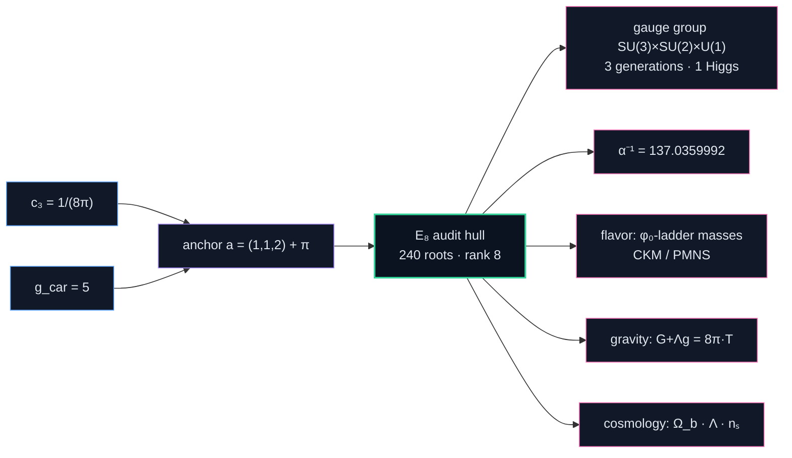

# The theory

> Technical overview of the TFPT compiler. For the epistemic status of each
> result see [`CLAIMS.md`](CLAIMS.md); for what is unresolved see
> [`OPEN_PROBLEMS.md`](OPEN_PROBLEMS.md).

TFPT models physics as a small deterministic **compiler**: two boundary inputs are fed in, an
`E8` "audit hull" is built as an intermediate object, and the Standard-Model + cosmology
read-outs fall out as **projections** — through a chain of exact identities and lattice/Lie
theorems, not fits.

> _Disambiguation:_ this is the **physics** theory TFPT (a compiler closure for the Standard
> Model). It is not the unrelated Brouwer–Lefschetz "topological fixed point theory" of
> mathematics (Nielsen/Lefschetz numbers).

## The two inputs

| Input | Symbol | Value | Role |
|---|---|---|---|
| Seam normalisation (P1) | `c₃` | `1/(8π)` | boundary/horizon constant |
| Carrier rank (P2) | `g_car` | `5` | the `3+2` carrier interface |

<p align="center">
  <br>
  <sub><em>The entire dimensionless input layer: a tempo <code>c₃ = 1/(8π)</code> and a width <code>g_car = 5</code>.</em></sub>
</p>

These two collapse further: both are the elementary-symmetric data of the **parabolic anchor**
`a = (1,1,2)`, so the genuine input layer is `a` plus the single transcendental `π`
(`c₃ = 1/(2·e₁(a)·π) = 1/(8π)`). The carrier choice `g_car = 5` is itself an *over-determined
bootstrap fixed point* (forced three independent ways via the `E8` closure), so the theory has
**no free load-bearing number** on the dimensionless axis — only `π` is primitive.

## The compiler pipeline



<details>
<summary>The exact text pipeline (with every intermediate identity)</summary>

```
  c₃ = 1/(8π)  ┐
               ├─►  anchor a=(1,1,2)  ──►  powers pₙ=2+2ⁿ ─► |R(E8)|=240, dim E8=248, rank 8
  g_car = 5    ┘                                            (E8 = audit/compiler hull, NOT a gauge group)
        │
        ├─►  carrier D5 ⊕ A3 + μ4  ──►  gauge group, hypercharge, N_fam = 3
        │
        ├─►  φ₀ = 1/(6π) + 48·c₃⁴  ──►  α⁻¹ = 137.0359992  (unique root of the boundary Ward identity)
        │
        ├─►  lattice operators (Q,K,R,L) on H₁(P¹∖μ4)=ℤ³,  det = (3,4,8,20),  ∏ = 1920 = |W(D5)|
        │         └─►  masses (φ₀-ladder), lepton c = (16/7, 4/3, 7/6), quark ratios (integer Plücker)
        │
        └─►  c₃ = Einstein/Jacobson 8π coefficient ─► full covariant G_ab+Λg_ab = c₃⁻¹T_ab (both coeffs fixed,
                                                       v359); R+R² scalaron M ≈ 3.06×10¹³ GeV; Λ ~ e^(−2α⁻¹);
                                                       Ω_b = (1−1/4π)φ₀ ≈ 0.04894
```

</details>

<table>
<tr>
<td width="50%" align="center">
  <br>
  <sub><em><b>E₈ is the referee, not a force.</b> The parts can lock into its 240-root pattern only one way — so most possible universes simply don't compile.</em></sub>
</td>
<td width="50%" align="center">
  <br>
  <sub><em><b>The loop closes on itself.</b> The proof shuts only for one tempo and one width, so the structure forces its own inputs — the fixed point the theory is named after.</em></sub>
</td>
</tr>
</table>

<p align="center">
  <br>
  <sub><em>What comes out of those two numbers — the whole Standard-Model skeleton, gravity, pieces of cosmology, and <code>α⁻¹</code> as just one line among many.</em></sub>
</p>

## What it produces (selected, all machine-checked)

- **`α⁻¹ = 137.0359992`** as the *unique* root of a boundary `U(1)` Ward identity (existence +
  uniqueness, interval-arithmetic verified).
- **Three fermion generations** `N_fam = 3 = rank A3 = dim H₁(P¹∖μ4)`.
- **Flavor**: an integer operator ladder with `det(Q,K,R,L) = (3,4,8,20)`, product
  `1920 = |W(D5)|`; charged-lepton coefficients `(16/7, 4/3, 7/6)` exactly; quark mass *ratios*
  as integer Plücker readouts (`c_u/c_d = 55/117`, …).
- **Solar angle** `sin²θ₁₂ = 1/3 − φ₀/2 = 0.306747` (frozen prediction of record, machine-enforced
  via `predictions_frozen.json`/`v84`; conditional on the seam-misalignment lemma).
- **Cosmology**: `Ω_b`, the Starobinsky scalaron mass, `Λ ~ e^(−2α⁻¹)`, cosmic birefringence
  `β = φ₀/(4π) ≈ 0.2424°`; the former external band `N_star ∈ [50,60]` is sharpened to a
  *conditional* point `N_star(k=0.05/Mpc) = 51.4` `[P]` via the scalaron-reheating chain (`v86`;
  `n_s = 0.9611`, `r = 0.0045`) — honestly recorded: the slow Higgs-channel point is
  `A_s`-disfavoured (−11.4σ; the measured `A_s` requires near-instantaneous reheating), so the
  frozen band stays the surface of record.
- **Self-consistency**: under the named gapped-transport hypotheses, "parameter-free" is a
  *theorem* — the gapped boundary transport (`Δ = 6·log(3/2) > 0`) has, by Perron–Frobenius, a
  **unique attractor** at rate `(2/3)⁶` (the physical identification of the transport operator
  stays `[P]`); the hull carries a literal order-`30 = 2·3·5` Coxeter cycle.

<details>
<summary><b>More machine-checked structural results</b> — icosahedral bedrock, master cover, spine tetrahedron, flavor diamond, the boundary QFT as one object</summary>

- **Icosahedral bedrock** (`v219`): *why* the atoms are `{2,3,5}` — `E₈` is the exceptional top of
  the McKay tower of finite `SU(2)` subgroups (`2I`, order `120 = |R⁺(E₈)|`, has irrep degrees equal
  to the affine-`E₈` Kac marks, `Σ = 30 = h(E₈)`), so choosing `E₈` is choosing the icosahedron. A
  backward certificate, not a P2 proof; the same geometry reads `41` (EM index) as a Gaussian norm and
  `7` (scalaron) as an Eisenstein norm of the one carrier split (`v222`).
- **Master cover** (`v85`): all anchor-block pencil covers are *one* double cover up to GL(2)
  Möbius reparametrisation (`disc = N_fam⁴·det(G)²`); Koide and the carrier are its two branch
  points, the scalaron exponent its trace; `μ₄` is *not* a 4:1 cover of the line (honest negative).
- **Spine tetrahedron** (`v91`): the spine `{2,3,4,5} = {e₃(a), p₀(a), e₁(a), e₂(a)}` is *one*
  finite object — edges `{6,8,10,12,15,20}`, faces `{24,30,40,60}`, volume `120 = |R⁺(E8)|`;
  `240 = |μ₄|·|E(K₄)|·|E(K₅)|` (breaks at `K₆` — specific, not generic). Dual cuts are typed as
  tautological presentation; `7, 16, 41, 48, 240, 248` lie *outside* the sub-grammar (honest).
  The tetrahedron is the *presentation raster of the anchor microcode* — the engine stays
  `a = (1,1,2)` (plus `p₀(a) = 3`).
- **Centered flavor diamond** (`v95`): the four flavor operators are *one* center plus *two*
  axes — `Q = U+V`, `R/L = C∓U` (winding), `K/F = C∓V` (sheet, `Spec V = {0,1,2}` = the cusp
  class); the center has `det C = 14`, `ΣC = 31 = 2^g−1` (the IR gap-bound numerator),
  `Pl_R(C) = 7·(2,3,1)` — the `G₂` reading stays audit-typed.
- **The boundary QFT as one relative object** (`v238`–`v261`, *Modular Spectral Closure*): the
  emergent-QFT round assembles the seam into `TFPT_QFT = (A_Σ, ω_Σ, Δ_Σ, ρ, A_F, H_F, D_F, J, γ, S_rel)`
  and collapses it to a single object. The 96-dim finite spectral triple (`A_F = ℍ_L⊕ℍ_R⊕M₄(ℂ)`, KO-6,
  order-zero, the first-order condition violated *exactly* by the Majorana = the CCvS σ mechanism, `v252`)
  is closed by three moves: the finite Dirac is the **modular/covariance induction** of the seam KMS state
  (`[D_F] = [D_Σ]⊗[K_car]`, the Yukawas a readout of `C_Σ`, `v258`); the spectral-action **cutoff is that
  KMS weight** so `f₂/f₀ = 1` exactly and `κ` becomes a finite-triple trace ratio (`v259`); and the seam
  (pillowcase), the carrier-16 (Kummer nodes) and `E₈` (`H²(K3) = U³⊕E₈(−1)²`) are facets of **one
  Kummer/K3 surface** (`v260`). The assembly certificate (`v261`) pins the cross-consistency — one number
  `4 = [B:A] = |μ₄| = 2χ = |(ℤ/2)²|`, one carrier-16, one gap `6log(3/2)` — so the layer is *QFT-complete
  modulo a single named theorem*, the **Seam Equivalence Theorem** `SEAM.EQUIV.01` (*the raw RP seam IS the
  holomorphic `(E8)₁` net at `τ=i`*; `v286`–`v288`). After the closing arc (`v300`–`v302`) that theorem's
  residual carries **no undischarged TFPT-internal assumption** — it is a composition of standard cited theorems
  (Steklov rigidity, the free-fermion classification, the AQFT stack) over established facts (the carrier-16, the
  derived gap `6log(3/2)>0`) — though it stays `[O]` (not machine-proved end-to-end). Ambient QG kept separate.

</details>

## Honest scope — the four layers

TFPT does **not** claim a certified strict Theory of Everything. It is honestly typed in four
layers (this separation is the discipline of the whole package):

| Layer | Content | Status |
|---|---|---|
| **1. Closed compiler** | `E8` glue, carrier, `α⁻¹`, `(R,K,Q,L)`, lepton/quark *ratios* | `[I]/[L]/[N]` |
| **2. Protected IR physics** | `R+R²`, admissible gapped transfer sector (OS-reconstructed *under RP/gap hypotheses*); the boundary QFT as one relative object (Modular Spectral Closure: Dirac = covariance induction, cutoff = KMS weight, seam/carrier/E₈ on one K3) | `[I]/[P]` |
| **3. Anchors** | `π`, one dimensionful induced-gravity scale, `U_point` absolute amplitude norm | `[A]` (declared, not "missing") |
| **4. Interfaces** | `m_p/m_e`, `η_B` (leptogenesis), Koide, axion relic, full ambient QG measure | `[P]/[A]` |

The single remaining **central theorem target** is to derive the `1/(8π)` area-law coefficient
from the replica variation of the seam determinant. Its *structure* is closed (Fursaev–Solodukhin
⟹ `c₃ = 1/(8π)` is the unique value giving `S = A/4`), its *mechanism* is exhibited at the
gapped-model level (`v150`) **and now numerically on the discretized collar with the seam's own
kernel and real replica sheets** (`v471`). The residual is the one irreducible dimensionful anchor
(`1/G` is UV-sensitive, Sakharov-type induced gravity) plus the continuum scaling limit — the same
MMST-class statement that is the single residual of `SEAM.EQUIV.01`. See
[`OPEN_PROBLEMS.md`](OPEN_PROBLEMS.md) for the full treatment.

## The theory documents (9 active LaTeX notes)

| File | Contents |
|---|---|
| [`introduction.tex`](../introduction.tex) | Entry point & reading guide; the two axioms, the two-engine picture, the status heatmap. |
| [`tfpt_1_architecture_e8.tex`](../tfpt_1_architecture_e8.tex) | **Core.** Axioms `{c₃, g_car}`, derivation map, EM fixed point, the `D5⊕A3+μ4 ⇒ E8` construction. |
| [`tfpt_2_standard_model.tex`](../tfpt_2_standard_model.tex) | **Standard Model.** The `φ₀`-ladder mass formula, flavor block, neutrinos, CKM/PMNS. |
| [`tfpt_3_e8_audit_bootstrap.tex`](../tfpt_3_e8_audit_bootstrap.tex) | **`E8` audit & bootstrap.** The seven `E8` slices, the cascade bridge, the Möbius self-consistency loop. |
| [`tfpt_4_frontier.tex`](../tfpt_4_frontier.tex) | **Frontier.** Honest status of `η_B`, `m_p/m_e`, Koide, dark matter, quantum gravity. |
| [`tfpt_5_redteam.tex`](../tfpt_5_redteam.tex) | **Red Team.** Adversarial stress test of the five load-bearing reductions (Targets A–E). |
| [`tfpt_horizon_readouts.tex`](../tfpt_horizon_readouts.tex) | **Appendix H.** `c₃ = 1/(8π)` as the universal horizon thermal code. |
| [`tfpt_research_contracts.tex`](../tfpt_research_contracts.tex) | The open gates as numbered lemma-chain *contracts* (`U_wall`, `G_metric`). |
| [`origin_theory.tex`](../origin_theory.tex) | Synthesis: the seam-as-horizon formulation, the attractor, one honestly-typed `[P]` cyclic interpretation. |
